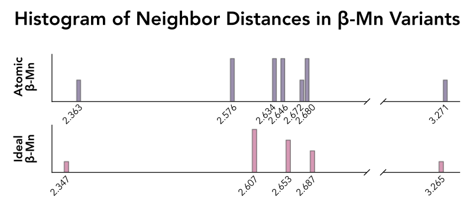

Refining and Experimenting with Structures
==========================================

**parsnip** allows users to set the Wyckoff positions of a crystal, enabling the
construction of modified -- or entirely new -- structures. In this example, we show
how an experimental beta-Manganese (cP20-Mn) structure can be refined into the
more uniform variant described by `O'Keefe and Andersson`_.

.. _`O'Keefe and Andersson`: https://doi.org/10.1107/S0567739477002228

These are the Wyckoff positions for elemental Beta-Manganese:

.. literalinclude:: betamn.cif
   :lines: 50-52

.. testsetup::

    >>> import os
    >>> import numpy as np
    >>> if "doc/source" not in os.getcwd(): os.chdir("doc/source")

Loading the file shows the twenty atoms we expect for β-Mn:

.. doctest::

    >>> from parsnip import CifFile
    >>> filename = "betamn.cif"
    >>> cif = CifFile(filename)
    >>> uc = cif.build_unit_cell()
    >>> assert uc.shape == (20, 3)

Introducing Beta-Manganese
^^^^^^^^^^^^^^^^^^^^^^^^^^

Beta-Manganese is a `tetrahedrally close-packed`_ (TCP) structure, a class of complex
phases whose geometry minimizes the distance between atoms in a manner that prevents the
formation of octahedral interstitial sites. Intuitively, one can image the bond network
of TCP structures forming a space-filling collection of irregular tetrahedra, with some
required amount of distortion imposed by the requirement that the structure tiles space.

It turns out that natural beta-Manganese actually has *more* variation in bond lengths
than is strictly required for this topology of structure. `O'Keefe and Andersson`_
noticed that moving the ``Mn1`` and ``Mn2`` Wyckoff positions by just ``0.0011`` and
``0.0042`` fractional units results in a TCP structure composed of bonds whose maximum
relative distance is lower than experiments predicted.

.. _`tetrahedrally close-packed`: https://www.chemie-biologie.uni-siegen.de/ac/hjd/lehre/ss08/vortraege/mehboob_tetrahedrally_close_packing_corr_.pdf

Using **parsnip**, we can explore the differences between experimental and ideal
beta-Manganese, quantifying the distribution of bond lengths in the crystal:

.. doctest::

    >>> from parsnip import CifFile
    >>> from math import sqrt
    >>> filename = "betamn.cif"
    >>> cif = CifFile(filename)
    >>> atomic_uc = cif.build_unit_cell()
    >>> assert atomic_uc.shape == (20, 3)
    >>> # Values are drawn from O'Keefe and Andersson, linked above.
    >>> x = 1 / (9 + sqrt(33))
    >>> mn1 = [x, x, x] # doctest: +FLOAT_CMP
    >>> mn1
    [0.0678216, 0.0678216, 0.0678216]
    >>> y = (9 - sqrt(33)) / 16
    >>> z = (13 - sqrt(33)) / 16
    >>> mn2 = [1 / 8, y, z]
    >>> mn2 # doctest: +FLOAT_CMP
    [0.1250000, 0.2034648, 0.4534648]

    >>> cif.set_wyckoff_positions([mn1, mn2])
    CifFile(file=betamn.cif) : 9 data entries, 2 data loops
    >>> # We should still have the same number of atoms
    >>> ideal_uc = cif.build_unit_cell(n_decimal_places=4)
    >>> assert ideal_uc.shape == atomic_uc.shape

Analyzing our New Structure
^^^^^^^^^^^^^^^^^^^^^^^^^^^

The following plot shows a histogram of neighbor distances for experimental
beta-Manganese (top) and the ideal structure (bottom). Each bar corresponds with a
single neighbor bond length, with each particle's neighbors existing at one of the
specified distances. Interestingly, althought the ideal structure has a more uniform
topology with fewer total distinct edges, the observed atomic structure more uniformly
distributes bonds to each particle.

A Note on Symmetry
^^^^^^^^^^^^^^^^^^

Modifying the Wyckoff positions of a crystal (without changing the symmetry operations)
cannot reduce the symmetry of the structure -- however, some choices of sites can
result in *additional* symmetry operations that are not present in the input space
group. While the example provided above preserved the space group of our crystal,
choosing a fractional coordinate that lies on a high symmetry point (like the origin,
or the center of the cell) can result in differences.

.. doctest-requires:: spglib

    >>> import spglib
    >>> box = cif.lattice_vectors
    >>> # Verify that our initial and "ideal" beta-Manganese cells share a space group
    >>> spglib.get_spacegroup((box, atomic_uc, [0] * 20))
    'P4_132 (213)'
    >>> spglib.get_spacegroup((box, ideal_uc, [0] * 20))
    'P4_132 (213)'
    >>> cif["_symmetry_Int_Tables_number"] # Data from the initial file.
    '213'

    >>> cif = CifFile("betamn.cif").set_wyckoff_positions([[0.0, 0.0, 0.0]])
    >>> different_uc = cif.build_unit_cell()
    >>> spglib.get_spacegroup((box, different_uc, [0] * len(different_uc)))
    'Fd-3m (227)'

Takeaways
^^^^^^^^^

**parsnip** allows us to use existing structural data to generate new crystals,
including those that have not been observed in experiment. While the example shown here
is relatively simple, assigning alternative Wyckoff positions enables high-throughput
materials discovery research and offers a simple framework by which structural features
can be explored.
