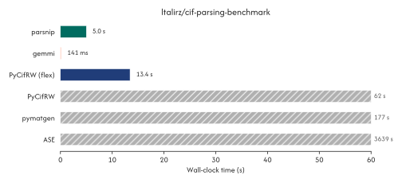
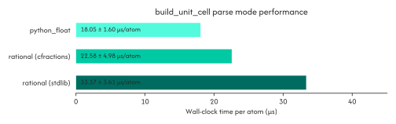

.. _performance:

===========
Performance
===========

Although `parsnip` is optimized for accuracy rather than performace, our parsing
strategy results in file reads and unit-cell reconstructions that are 3-500x faster than
comparable tools. The following data makes use of [ltalirz/cif-parsing-benchmark](https://github.com/ltalirz/cif-parsing-benchmark), a benchmark that profiles the parsing
throughput of several open-source CIF libraries.

While not the fastest CIF parser around, `parsnip` achieves competetive performance when
reading files in addition to our class-leading accuracy.

Increasing Performance
^^^^^^^^^^^^^^^^^^^^^^

In some cases, particularly when constructing thousands of unit cells, the performance
of parsnip's ``build_unit_cell`` may become a bottleneck. **parsnip** includes several
tools for resolving this: first, ``parse_mode="python_float"`` attempts to build unit
cells using floating point arithmetic rather than rational expression. This is less
accurate, but is still sufficient for high-quality databases and stuctures. For the
best combination of performance and accuracy, installing the `cfractions`_ library lets
**parsnip** use more optimized code for unit cell reconstruction. This is functionally
equivalent to the default mode, but several times faster.

.. _cfractions: https://pypi.org/project/cfractions/

.. doctest::

    >>> # uv pip install cfractions
    >>> from parsnip import CifFile
    >>> cif = CifFile("hP3.cif")

    >>> # If `cfractions` is available it is used by the default `parse_mode="rational"`
    >>> faster = cif.build_unit_cell(n_decimal_places=4)
    >>> faster
    array([[0.2254    , 0.        , 0.33333  ],
           [0.        , 0.2254    , 0.6666633],
           [0.7746    , 0.7746    , 0.99999667]])
    >>> assert faster.shape == (3, 3)

Reproducing these Benchmarks
^^^^^^^^^^^^^^^^^^^^^^^^^^^^

All benchmarks in this file were obtained using Python 3.13.2 on an M1 Macbook Pro, with
parsnip version <TODO> and the `uv.lock` file associated with that tag.
